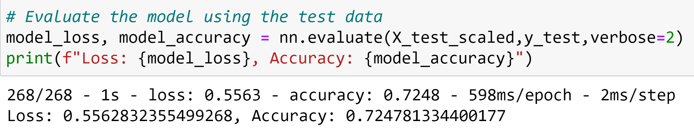
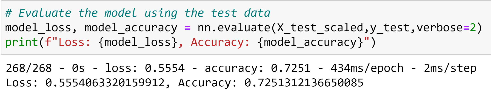
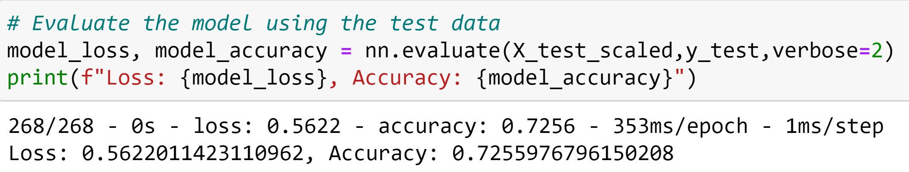
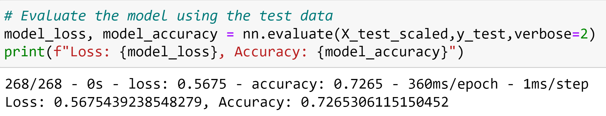

# Neural Network Charity Analysis
## Project Overview
The current project was conducted for the non-profit organization Alphabet Soup. This organization raises and then donates money to organizations that work to protect the environment, improve peoples' well-being, and unify the world. The purpose of this project was to develop a neural network model that would accurately predict which organizations would be successful if funded by Alphabet Soup. 

**Data:** [Alphabet Soup Data](Resources/charity_data.csv)   
**Tools:** Scikit-Learn, TensorFlow   
**Code:** [Original Model](AlphabetSoupCharity.ipynb), [Optimization Attempts and Random Forest](AlphabetSoupCharity_Optimization.ipynb)    
 
## Results
### Data Preprocessing
Numeric features were scaled using the standard scalar, and categorical features were converted to numeric values using one-hot encoding. In additon, Application_Type and Classification were binned. 

- Target Variable: Is_Successful
- Feature Variables: Application_Type, Affiliation, Classification, Use_Case, Organization, Status, Income_AMT, Ask_AMT
- Removed Variables: EIN, Name, Special_Considerations

### Compiling, Training, and Evaluating the Model
For all of the models: ReLU activation was used for the hidden layers as it is the most commonly used, and is less susceptible to vanishing gradients as with Sigmoid or Tanh. A Sigmoid activation function was used for the output as the goal of the model was binary classification. 

#### Original Model: 
- Hidden Layers: 
    - Layer 1: 80 neurons, ReLU activation
    - Layer 2: 30 neurons, ReLU activation
- Output Layer: Sigmoid activation

80 Neurons were chosen for the first layer because that is approximately twice the number of features, then roughly half of that number of neurons were used for the second layer. NOTE: This original model still included the Special_Considerations feature. 
 

#### Optimization Attempt 1:
- Hidden Layers: 
    - Layer 1: 80 neurons, ReLU activation
    - Layer 2: 30 neurons, ReLU activation
- Output Layer: Sigmoid activation

The number of layers and neurons were kept the same as the original, however, this model had the Special_Considerations feature removed in an attempt to increase the model's performance because only 27 cases had special considerations. The model had an accuracy score of 72.5% which was an increase from the original, but did not reach the target accuracy of 75%.  
 

#### Optimization Attempt 2:
- Hidden Layers: 
    - Layer 1: 123 neurons, ReLU activation
    - Layer 2: 82 neurons, ReLU activation
- Output Layer: Sigmoid activation

To improve the performance of the model, number of neurons was increased. The number of neurons for the first later was three times the number of features, and the number of neurons for the second layer was two times the number of features. The model had an accuracy score of 72.6% which was an increase over the previous attempt, but did not reach the target accuracy of 75%.     
 

#### Optimization Attempt 3:
- Hidden Layers: 
    - Layer 1: 123 neurons, ReLU activation
    - Layer 2: 82 neurons, ReLU activation
    - Layer 3: 41 neurons, ReLU activation
- Output Layer: Sigmoid activation

In a final attempt to improve the performance of the model, an additional layer was added. The number of neurons for the first later was three times the number of features, the number of neurons for the second layer was two times the number of features, and the number of neurons for the third layer was equal to the number of features. The model had an accuracy score of 72.7% which was an increase over the previous two attempts, but did not reach the target accuracy of 75%.   
   

## Summary
Despite 3 attempts at optimization, the model accuracy never reached the 75% target accuracy. Another option to a neural network model is a random forest classifier model. For example, when this data was analyzed using a random forest classifier model, the resulting accuracy was 71%. This is comparable to the 72.7% accuracy of the neural network model, and the forest model ran in a fraction of the time that was required for the neural network model to run. In addition, the forest model required less code. Because of the faster performance and simplicity, I would recommend that Alphabet Soup use a random forest classifier model in the future. 